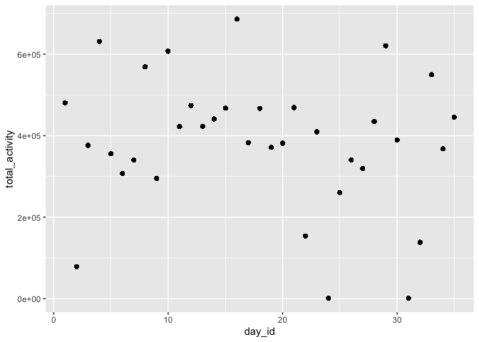
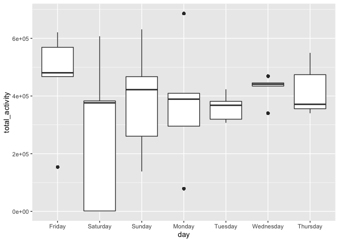
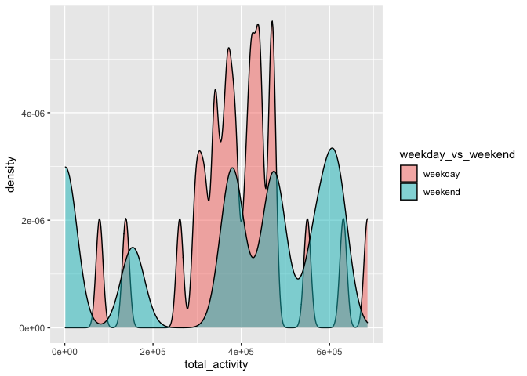
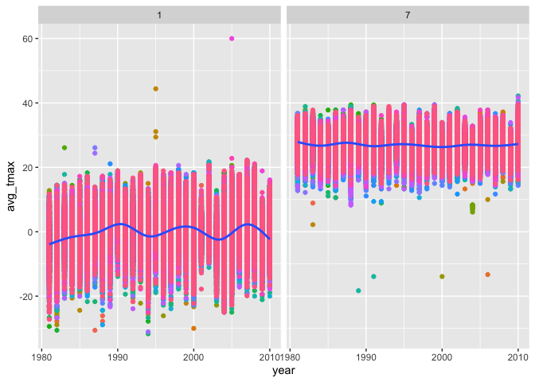

hw3 data visualization
================
Yutian Luo
10/6/2020

``` r
# install.packages("devtools")
devtools::install_github("p8105/p8105.datasets")
```

    ## Skipping install of 'p8105.datasets' from a github remote, the SHA1 (412759e3) has not changed since last install.
    ##   Use `force = TRUE` to force installation

``` r
library(p8105.datasets)
library(tidyverse)
```

    ## ── Attaching packages ─────────────── tidyverse 1.3.0 ──

    ## ✓ ggplot2 3.3.2     ✓ purrr   0.3.4
    ## ✓ tibble  3.0.3     ✓ dplyr   1.0.2
    ## ✓ tidyr   1.1.2     ✓ stringr 1.4.0
    ## ✓ readr   1.3.1     ✓ forcats 0.5.0

    ## ── Conflicts ────────────────── tidyverse_conflicts() ──
    ## x dplyr::filter() masks stats::filter()
    ## x dplyr::lag()    masks stats::lag()

``` r
library(dplyr)
library(ggridges)
data("instacart")
```

# Problem 1

The goal is to do some exploration of this dataset.

To that end, write a short description of the dataset, noting the size
and structure of the data, describing some key variables, and giving
illstrative examples of observations

How many aisles are there, and which aisles are the most items ordered
from?

Make a plot that shows the number of items ordered in each aisle,
limiting this to aisles with more than 10000 items ordered. Arrange
aisles sensibly, and organize your plot so others can read it.

``` r
instacart %>% 
  count(aisle) %>% 
  filter(n > 1000) %>% 
  ggplot(aes(x = aisle, y = n)) + 
  geom_point() +
  theme(axis.text.x = element_text(angle = 90, vjust = 0.5, hjust = 1))
```

<!-- -->

Make a table showing the three most popular items in each of the aisles
“baking ingredients”, “dog food care”, and “packaged vegetables
fruits”. Include the number of times each item is ordered in your
table.

``` r
instacart %>% 
  filter(aisle %in% c("baking ingredients", "dog fodd care", "packaged vegetables fruits")) %>% 
  group_by(aisle) %>% 
  count(product_name) %>% 
  mutate(rank = min_rank(desc(n))) %>% 
  filter(rank < 4) %>% 
  arrange(aisle, rank) %>% 
  knitr::kable()
```

| aisle                      | product\_name        |    n | rank |
| :------------------------- | :------------------- | ---: | ---: |
| baking ingredients         | Light Brown Sugar    |  499 |    1 |
| baking ingredients         | Pure Baking Soda     |  387 |    2 |
| baking ingredients         | Cane Sugar           |  336 |    3 |
| packaged vegetables fruits | Organic Baby Spinach | 9784 |    1 |
| packaged vegetables fruits | Organic Raspberries  | 5546 |    2 |
| packaged vegetables fruits | Organic Blueberries  | 4966 |    3 |

Make a table showing the mean hour of the day at which Pink Lady Apples
and Coffee Ice Cream are ordered on each day of the week; format this
table for human readers (i.e. produce a 2 x 7 table).

``` r
instacart %>% 
  filter(product_name %in% c("Pink Lady Apples","Coffee Ice Cream")) %>% 
  group_by(product_name, order_dow) %>% 
  summarize(mean_hour = mean(order_hour_of_day)) %>% 
  pivot_wider(
    names_from = order_dow,
    values_from = mean_hour
  ) %>% 
  knitr::kable()
```

    ## `summarise()` regrouping output by 'product_name' (override with `.groups` argument)

| product\_name    |        0 |        1 |        2 |        3 |        4 |        5 |        6 |
| :--------------- | -------: | -------: | -------: | -------: | -------: | -------: | -------: |
| Coffee Ice Cream | 13.77419 | 14.31579 | 15.38095 | 15.31818 | 15.21739 | 12.26316 | 13.83333 |
| Pink Lady Apples | 13.44118 | 11.36000 | 11.70213 | 14.25000 | 11.55172 | 12.78431 | 11.93750 |

## Problem 2

In this spreadsheet, variables activity.\* are the activity counts for
each minute of a 24-hour day starting at midnight.

Q: Load, tidy, and otherwise wrangle the data. Your final dataset should
include all originally observed variables and values; have useful
variable names; include a weekday vs weekend variable; and encode data
with reasonable variable classes.

``` r
accel_data = 
  read_csv(file = "./data/accel_data.csv") %>% 
  # pivot to long format
  pivot_longer(
    activity.1 : activity.1440,
    names_to = "minute",
    values_to = "activity_count"
  ) %>% 
  mutate(
    weekday_vs_weekend = 
      ifelse(day == 'Friday' | day == 'Saturday', "weekend", "weekday"),
    weekday_vs_weekend = as.factor(weekday_vs_weekend),
    day = as.factor(day)
  ) %>%
  separate(minute, into = c("acti","minute"), sep = 9, remove = TRUE) %>% 
  mutate(
    minute = as.integer(minute)
  ) %>% 
  select(-acti) 
```

    ## Parsed with column specification:
    ## cols(
    ##   .default = col_double(),
    ##   day = col_character()
    ## )

    ## See spec(...) for full column specifications.

``` r
# take a look at the tidy data
head(accel_data) %>% 
knitr::kable()
```

| week | day\_id | day    | minute | activity\_count | weekday\_vs\_weekend |
| ---: | ------: | :----- | -----: | --------------: | :------------------- |
|    1 |       1 | Friday |      1 |        88.37778 | weekend              |
|    1 |       1 | Friday |      2 |        82.24444 | weekend              |
|    1 |       1 | Friday |      3 |        64.44444 | weekend              |
|    1 |       1 | Friday |      4 |        70.04444 | weekend              |
|    1 |       1 | Friday |      5 |        75.04444 | weekend              |
|    1 |       1 | Friday |      6 |        66.26667 | weekend              |

Q:

Describe the resulting dataset (e.g. what variables exist, how many
observations, etc).

A:

The dataset contains all the recorded activity of the patient, given
that record interval is 1 minute. It contains variables week, day\_id,
day, minute, activity\_count, weekday\_vs\_weekend, and it has a total
dimension of \[50,400 x 6\]. The total observation is 50400.

Q:

Traditional analyses of accelerometer data focus on the total activity
over the day.Using your tidied dataset, aggregate accross minutes to
create a total activity variable for each day, and create a table
showing these totals.

``` r
# create a table showing total activity
accel_data_df1 =
  accel_data %>% 
  group_by(day_id) %>% 
  summarize(total_activity = sum(activity_count))
```

    ## `summarise()` ungrouping output (override with `.groups` argument)

``` r
# show the table
accel_data_df1 %>% 
  knitr::kable()
```

| day\_id | total\_activity |
| ------: | --------------: |
|       1 |       480542.62 |
|       2 |        78828.07 |
|       3 |       376254.00 |
|       4 |       631105.00 |
|       5 |       355923.64 |
|       6 |       307094.24 |
|       7 |       340115.01 |
|       8 |       568839.00 |
|       9 |       295431.00 |
|      10 |       607175.00 |
|      11 |       422018.00 |
|      12 |       474048.00 |
|      13 |       423245.00 |
|      14 |       440962.00 |
|      15 |       467420.00 |
|      16 |       685910.00 |
|      17 |       382928.00 |
|      18 |       467052.00 |
|      19 |       371230.00 |
|      20 |       381507.00 |
|      21 |       468869.00 |
|      22 |       154049.00 |
|      23 |       409450.00 |
|      24 |         1440.00 |
|      25 |       260617.00 |
|      26 |       340291.00 |
|      27 |       319568.00 |
|      28 |       434460.00 |
|      29 |       620860.00 |
|      30 |       389080.00 |
|      31 |         1440.00 |
|      32 |       138421.00 |
|      33 |       549658.00 |
|      34 |       367824.00 |
|      35 |       445366.00 |

Q:

Are any trends apparent?

``` r
accel_data_df2 = 
  right_join(x = accel_data, y = accel_data_df1) %>% 
  mutate(
    day = forcats::fct_relevel(day, c("Friday", "Saturday", "Sunday", "Monday", "Tuesday", "Wednesday", "Thursday"))
  )
```

    ## Joining, by = "day_id"

``` r
# detect any trend using line plot and smooth line plot

# preliminary:
# scatterplot: total activity by day_id
accel_data_df2 %>% 
  ggplot(mapping = aes(x = day_id, y = total_activity)) + 
  geom_point()
```

<!-- -->

``` r
# smooth curve: total activity by day_id
accel_data_df2 %>% 
   ggplot(aes(x = day_id, total_activity)) + 
  geom_point() + 
  geom_smooth()
```

    ## `geom_smooth()` using method = 'gam' and formula 'y ~ s(x, bs = "cs")'

<!-- -->

``` r
# boxplot: total activity by day
accel_data_df2 %>% 
  ggplot(aes(x = day, total_activity)) + 
  geom_boxplot()
```

<!-- -->

``` r
# density: total activity by weekend
accel_data_df2 %>% 
  ggplot(aes(x = total_activity, fill = weekday_vs_weekend)) +      geom_density(alpha = 0.5, adjust = 0.9)
```

<!-- -->

A:

According to the scatter smooth curve, there is a limited evidence of
trend, which indicates that the activity increases as the observational
days increase, and it decreases after the 18th day. It returns back to a
higher value at 35th day.

In relation to each weekdays, each day have different means and range.
However, Satureday has the largest range for activity. Wednesday and
Tuesday have a very little range. Friday is the most active day.

Observe the weekday and weekend’s relation with daily acitivity, we can
say that weekdays have a more stable activity, while weekend activity
often varies a lot.

It should be noted, that the observational time is limited in 5 weeks.
Some more significant observations can be made about the weekday
weekends’ relation to daily activity if the time period is longer.

Q:

Accelerometer data allows the inspection activity over the course of the
day. Make a single-panel plot that shows the 24-hour activity time
courses for each day and use color to indicate day of the week.

``` r
accel_data %>% 
  ggplot(aes(x = minute, activity_count, color = day)) + 
  geom_line() +
  scale_x_continuous(
    breaks = c(0, 240, 480, 720, 960, 1200, 1440),
    labels = c("0:00", "04:00", "08:00", "12:00", "16:00", "20:00", "24:00")
  ) 
```

<!-- -->

Q:

Describe in words any patterns or conclusions you can make based on this
graph.

A:

Wednesday has the lowest activity level in the coures of day. The
activity level has to high points: around noon and around 8pm - 9pm. We
can also see that the patient is very active in Friday nights.

# Problem 3

``` r
library(p8105.datasets)
data("ny_noaa")
```

Q:

The goal is to do some exploration of this dataset. To that end, write a
short description of the dataset, noting the size and structure of the
data, describing some key variables, and indicating the extent to which
missing data is an issue

``` r
# describe data
ny_noaa
```

    ## # A tibble: 2,595,176 x 7
    ##    id          date        prcp  snow  snwd tmax  tmin 
    ##    <chr>       <date>     <int> <int> <int> <chr> <chr>
    ##  1 US1NYAB0001 2007-11-01    NA    NA    NA <NA>  <NA> 
    ##  2 US1NYAB0001 2007-11-02    NA    NA    NA <NA>  <NA> 
    ##  3 US1NYAB0001 2007-11-03    NA    NA    NA <NA>  <NA> 
    ##  4 US1NYAB0001 2007-11-04    NA    NA    NA <NA>  <NA> 
    ##  5 US1NYAB0001 2007-11-05    NA    NA    NA <NA>  <NA> 
    ##  6 US1NYAB0001 2007-11-06    NA    NA    NA <NA>  <NA> 
    ##  7 US1NYAB0001 2007-11-07    NA    NA    NA <NA>  <NA> 
    ##  8 US1NYAB0001 2007-11-08    NA    NA    NA <NA>  <NA> 
    ##  9 US1NYAB0001 2007-11-09    NA    NA    NA <NA>  <NA> 
    ## 10 US1NYAB0001 2007-11-10    NA    NA    NA <NA>  <NA> 
    ## # … with 2,595,166 more rows

``` r
summary(ny_noaa)
```

    ##       id                 date                 prcp               snow       
    ##  Length:2595176     Min.   :1981-01-01   Min.   :    0.00   Min.   :  -13   
    ##  Class :character   1st Qu.:1988-11-29   1st Qu.:    0.00   1st Qu.:    0   
    ##  Mode  :character   Median :1997-01-21   Median :    0.00   Median :    0   
    ##                     Mean   :1997-01-01   Mean   :   29.82   Mean   :    5   
    ##                     3rd Qu.:2005-09-01   3rd Qu.:   23.00   3rd Qu.:    0   
    ##                     Max.   :2010-12-31   Max.   :22860.00   Max.   :10160   
    ##                                          NA's   :145838     NA's   :381221  
    ##       snwd            tmax               tmin          
    ##  Min.   :   0.0   Length:2595176     Length:2595176    
    ##  1st Qu.:   0.0   Class :character   Class :character  
    ##  Median :   0.0   Mode  :character   Mode  :character  
    ##  Mean   :  37.3                                        
    ##  3rd Qu.:   0.0                                        
    ##  Max.   :9195.0                                        
    ##  NA's   :591786

``` r
# describe NA: id and date both have no missing
anyNA(ny_noaa$id)       
```

    ## [1] FALSE

``` r
anyNA(ny_noaa$date)
```

    ## [1] FALSE

``` r
na_tmax = sum(is.na(ny_noaa$tmax))
na_tmin = sum(is.na(ny_noaa$tmin))
na_prcp = sum(is.na(ny_noaa$prcp))
na_snow = sum(is.na(ny_noaa$snow))
na_snwd = sum(is.na(ny_noaa$snwd))
na_total = sum(is.na(ny_noaa))
```

A:

The dataset have a size of 7 \* 2595176. It describes the weather record
of the area from 1981-01-01 to 2010-12-31. The variables that describes
weather metrics include: prcp, snow, snwd, tmax, tmin.

Among these data of 18166232, there are 3387623 missing values, which
takes up to 18.6479122 % of the observations. Among these, 33.4853672 %
are from tmax, 33.4871974 % are from tmin.

Q:

Do some data cleaning. Create separate variables for year, month, and
day. Ensure observations for temperature, precipitation, and snowfall
are given in reasonable units.

``` r
ny_noaa_tidy = 
ny_noaa %>% 
  mutate(
    date = as.character(date),
    tmax = as.numeric(tmax),
    tmin = as.numeric(tmin),
    prcp = prcp / 10,
    tmax = tmax / 10,
    tmin = tmin / 10
  ) %>% 
  separate(date, into = c("year", "month", "day"), sep = "-") %>% 
  mutate(
    year = as.numeric(year),
    month = as.numeric(month),
    day = as.numeric(day)
  )

# most commonly observed snowfall
snow_count = count(ny_noaa, snow) %>% 
  mutate(
    snow_rank = min_rank(desc(n))
  ) %>% 
  arrange(snow_rank, by_group = FALSE)
```

Q:

For snowfall, what are the most commonly observed values? Why?

A:

0.  Since most of the days in a year it is not snowing.

Q:

Make a two-panel plot showing the average max temperature in January and
in July in each station across years.

``` r
ny_noaa_df1 = 
ny_noaa_tidy %>% 
  filter(month == 1 | month == 7) %>%
  group_by(id, month, year, day) %>% 
  summarize(
    avg_tmax = mean(tmax, na.rm = TRUE)
  ) %>% 
  drop_na()
```

    ## `summarise()` regrouping output by 'id', 'month', 'year' (override with `.groups` argument)

``` r
ggplot(ny_noaa_df1, aes(x = year, avg_tmax)) + 
  geom_point()+
  geom_smooth(se = FALSE)+
  facet_grid(.~month)
```

    ## `geom_smooth()` using method = 'gam' and formula 'y ~ s(x, bs = "cs")'

<!-- -->

Q:

Is there any observable / interpretable structure? Any outliers?

A:

The average max temperature is higher in July, by 20 degress
approximately. In January, the variations in tmax is greater than that
in July. Also, the average tmax fluctuates a lot over the years from
1980 to 2010, this implies some more interesting hypothesis to be
analyzed relating years with temperature change.

Q:

Make a two-panel plot showing (i) tmax vs tmin for the full dataset
(note that a scatterplot may not be the best option); (ii) make a plot
showing the distribution of snowfall values greater than 0 and less than
100 separately by year.
